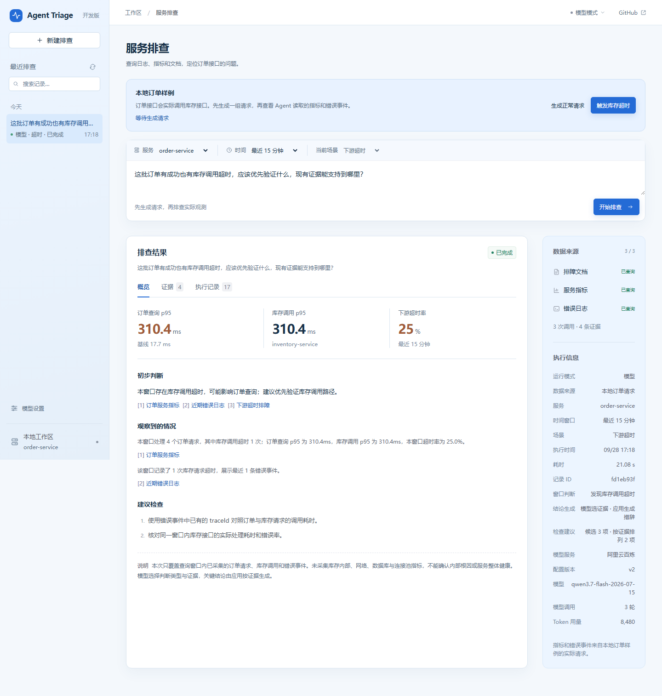

# Agent Triage

[](https://github.com/MoChiUaena/agent-triage/actions/workflows/ci.yml)

Agent Triage 是一个面向 Java 服务的只读排障助手。它结合窗口指标、错误日志和排障文档，排查下游 HTTP 超时和数据库连接池耗尽，并给出验证建议。仓库提供真实请求样例，也支持通过配置和只读接口接入其他本地 Spring Boot 服务。

仓库提供两条真实请求链路：订单服务通过 HTTP 调用独立库存服务，数据库样例通过 HikariCP 查询 H2。实验操作可以实际触发下游超时、获取连接超时与 SQL 锁等待，Agent 读取对应窗口的指标和错误事件后给出判断。默认启动使用合成订单数据；模型模式由模型选择工具、判断和证据，应用核对观测后生成关键结论。

首次了解项目可阅读[项目导览](docs/PROJECT_GUIDE.md)，其中说明页面结果、运行模式、进程职责和当前边界。



图中是 4 次实际处理的样例请求，其中 1 次库存调用超时，窗口超时率为 25%；数值随机器和运行次数变化。

[50 秒演示录像](docs/assets/agent-triage-demo.mp4)：前半录制实际 HTTP 请求排查，后半回放百炼历史结果。无声字幕，完整标识符已脱敏；录制说明见[演示说明](docs/DEMO.md)。

[v4 首次留出对照](docs/validation/2026-09-28-v4-holdout.md)的 6 个案例中，4 条符合证据契约，2 条由应用门槛返回证据不足，没有失败。应用提供服务参考规则，并从模型有效候选中排序、显示两项检查建议，保留原始选择。关键结论与排序由应用策略生成，这组小样本不代表模型自由归因能力或生产准确率。

## 功能

- 查询服务指标、近期错误日志，检索 Markdown 排障文档。
- 通过服务白名单登记多个本地应用，在页面选择服务；接入接口与示例见[接入说明](docs/SERVICE_INTEGRATION.md)。
- 提供 [Spring Boot Starter](docs/STARTER.md) 复用只读观测接口，独立[商品应用](catalog-service/README.md)验证 HTTP 与 JDBC 接入。
- 用 HikariCP 与 H2 实际触发[数据库连接池耗尽](docs/DATABASE_POOL.md)，区分获取连接超时与 SQL 查询失败，并验证释放后的恢复。
- 在页面生成正常请求或库存超时请求，排查真实的本地请求记录。
- 通过 SSE 展示工具执行进度，点击结论中的引用可以查看证据原文。
- 保存执行记录，支持历史查询和事件重放。
- 概览、证据、执行记录分开查看，支持搜索历史记录。
- 限制工具调用次数和执行时间，分别处理执行失败与证据不足。
- 支持[主动取消排查](docs/RUN_CONTROLS.md)，保留已有证据；展示输入、输出 Token 和用量完整程度，并提供失败后的检查提示。
- 模型模式校验工具参数和结果引用，记录调用轮数及服务端返回的 token 用量。
- 在[模型设置页](http://127.0.0.1:18080/settings.html)添加、测试和选择模型服务；更改配置无需重启。

## 快速启动

免构建的演示包在 [v0.1.0 预览发布](https://github.com/MoChiUaena/agent-triage/releases/tag/v0.1.0) 中提供。需要 JDK 21，完整解压后运行：

该发布包固定在首版订单／库存流程。main 中的多服务、数据库和取消功能请按下面的源码方式构建；发布附件不会随 main 更新。

包含后续功能的 [v0.2.0 候选包](docs/releases/v0.2.0.md)可从源码构建，提供四种服务接入和六个进程的统一启动方式。

```powershell
powershell -ExecutionPolicy Bypass -File .\start-demo.ps1
```

macOS/Linux 使用 `bash start-demo.sh`，另需 curl。脚本启动三个服务，首次默认用固定规则读取实际本地请求；按 Ctrl+C 一起停止。数据库与日志保存在解压目录。下面是从源码启动的方式。

需要 JDK 21+。仓库自带 Maven Wrapper，首次构建会下载 Maven 和依赖。

```powershell
git clone https://github.com/MoChiUaena/agent-triage.git
cd agent-triage
# 按本机 JDK 安装位置修改；已配置 JDK 21 时可跳过
$env:JAVA_HOME = 'C:\path\to\jdk-21'
.\mvnw.cmd verify
.\mvnw.cmd spring-boot:run
```

macOS / Linux：设置好 JDK 21 后运行 `./mvnw verify`，再运行 `./mvnw spring-boot:run`。

打开 <http://127.0.0.1:18080>。默认使用 H2 文件数据库，记录保存在 `data/` 目录。按 `Ctrl+C` 停止服务。

也可以打包运行：`./mvnw package`，然后执行 `java -jar target/agent-triage-0.2.0.jar`。Windows 下重新打包前需先停止正在运行的 JAR。

## 跑通本地真实请求

先在两个终端分别启动[库存服务](inventory-service/README.md)和[订单服务](sample-service/README.md)：

```powershell
.\mvnw.cmd -f inventory-service/pom.xml verify
java -jar inventory-service/target/triage-inventory-service-0.2.0.jar
```

```powershell
.\mvnw.cmd -f sample-service/pom.xml verify
java -jar sample-service/target/triage-sample-service-0.2.0.jar
```

在第三个终端启动排障助手：

```powershell
$env:TRIAGE_OBSERVATION_SOURCE = 'LIVE'
.\mvnw.cmd spring-boot:run
```

打开 <http://127.0.0.1:18080>，点击“生成正常请求”或“触发库存超时”，再点“开始排查”。页面会显示实际请求数、耗时、超时率和带 traceId 的错误事件。订单和库存服务分别监听本机 `18082`、`18084` 端口；错误事件写入本地 JSON Lines 文件，指标可通过两个服务的 Actuator 端点核对。浏览器中的生成流量按钮与只读的 Agent 工具分开。

也可以运行 `python scripts/live_smoke.py --agent-url http://127.0.0.1:18080`，复查空窗口、正常与超时三条链路。默认合成模式不需要启动样例服务。

## 试一下

默认合成模式下，输入“订单查询接口为什么变慢了？”，分别运行以下两个场景：

| 场景 | 订单查询 p95 | 库存调用 p95 | 库存调用超时率 |
|---|---|---|---|
| 下游超时 | 2350ms | 2100ms | 18% |
| 正常对照 | 120ms | 45ms | 0% |

这些是演示适配器的固定数据。超时场景会提示检查库存下游调用；正常场景会提示未发现下游超时证据。点击引用可跳转到“证据”标签页查看原文，指标和日志也可以单独展开。

切换场景只影响新执行。刷新页面后，可以从“执行记录”重新打开结果。输入“写一首诗”等无关问题，会返回“证据不足”。

左侧可搜索最近的排查记录。“新建排查”会清空当前结果，保留已有记录；输入问题后也可按 `Ctrl+Enter` 提交（macOS 为 `⌘+Enter`）。窄屏下通过左上角菜单打开历史记录。

## PostgreSQL

如需使用 PostgreSQL，先通过 Docker Compose 启动数据库：

```powershell
docker compose up -d --wait postgres
$env:SPRING_PROFILES_ACTIVE = 'postgres'
.\mvnw.cmd spring-boot:run
```

默认连接本机 `15432` 端口，数据库名和用户均为 `triage`，本地演示密码为 `triage-local-demo`。可通过 `TRIAGE_DB_URL`、`TRIAGE_DB_USER`、`TRIAGE_DB_PASSWORD` 覆盖。

自定义密码需在首次初始化数据库前设置；修改环境变量不会更新已有数据卷的密码。使用 `docker compose stop` 停止数据库，清除 `SPRING_PROFILES_ACTIVE` 后可切回 H2。两种存储的历史记录相互独立。

## 模型模式

打开[模型设置页](http://127.0.0.1:18080/settings.html)，选择 DeepSeek、阿里云百炼、智谱 GLM、Kimi、LM Studio 或自定义兼容接口，再填写 API Key。保存后可测试连接并设为当前模型。配置方法、调用限制和费用说明见[模型配置](docs/MODELS.md)。

模型链路已通过本地模拟接口与真实百炼检查。新版模型只选择判断、工具、引用和候选检查项；应用校验当前观测并生成关键结论，原始与展示检查项分开保存。其他供应商预设尚未用真实凭据验证。

配置模型并启用 LIVE 数据源后，可用 `python scripts/live_model_eval.py --allow-model-calls` 检查空窗口、正常与库存超时三条链路。脚本保存工具顺序、证据引用、模型轮次和用量；服务端可能计费。运行方法和模拟接口结果见[小规模评测](docs/EVALUATION.md#live-数据源与模型模式)。

要比较“仅检索文档”和 Agent 的实际回答，可运行 `python scripts/compare_live_methods.py --allow-model-calls`。默认先跑四个调试案例，结果写入 `target/live-comparison/`；评审方法和留出集约束见[小规模评测](docs/EVALUATION.md#后续比较)。

当前结果见 [v4 首次留出对照](docs/validation/2026-09-28-v4-holdout.md)。[旧版自由文本报告](docs/validation/2026-09-27-holdout-comparison.md)保留误写证据与过强归因等失败，新版不会改写旧历史。输出格式和反馈限额见[模型判断契约](docs/MODEL_OUTPUT.md)。

## 测试

```powershell
.\mvnw.cmd -B -ntp verify
# 保持服务运行，在另一个终端执行；需要 Python 3.10+
python scripts/smoke.py
```

JUnit 覆盖工具参数、超时与取消、引用校验、重启恢复、HTTP 接口和 SSE 重放。冒烟脚本运行 4 个案例，将结果写入 `target/smoke/`。依赖缓存后可以使用 `./mvnw -o verify` 离线测试。

CI 在 Windows、Linux 和 PostgreSQL 环境运行，不需要模型凭据。具体覆盖范围和运行结果见[测试说明](docs/VALIDATION.md)。

## 配置

| 设置 | 默认值 | 含义 |
|---|---|---|
| `PORT` | `18080` | HTTP 端口 |
| `TRIAGE_MAX_TOOL_CALLS` | `3` | 每次执行调用上限，可配置 1–10 |
| `TRIAGE_TOOL_TIMEOUT` | `2s` | 单次工具超时，范围 1ms–10s |
| `TRIAGE_RUN_TIMEOUT` | `60s` | 整体执行超时，范围 1ms–120s |
| `SPRING_PROFILES_ACTIVE` | 未设置 | 设置 `postgres` 切换数据库 |

默认查询 `order-service`，也可以通过[服务配置与观测接口](docs/SERVICE_INTEGRATION.md)接入其他本地 Spring Boot 服务。时间窗口为 1–60 分钟，可按服务收紧，问题最多 200 字符。超时从提交时开始计时；数据库 I/O 和不响应中断的工具仍可能超过该时限，详见[执行与超时](docs/ARCHITECTURE.md#执行与超时)。

应用默认仅监听本机地址，尚未实现鉴权、多实例协调和记录清理。提交的问题会保存在数据库中，请勿输入敏感信息。

## 文档

- [项目导览](docs/PROJECT_GUIDE.md)
- [API](docs/API.md)
- [模型配置](docs/MODELS.md)
- [架构](docs/ARCHITECTURE.md)
- [本地真实请求链路](docs/LIVE_LAB.md)
- [接入其他服务](docs/SERVICE_INTEGRATION.md)
- [数据库连接池排查](docs/DATABASE_POOL.md)
- [取消、失败提示与用量](docs/RUN_CONTROLS.md)
- [小规模评测](docs/EVALUATION.md)
- [开发计划](docs/ROADMAP.md)
- [贡献指南](CONTRIBUTING.md)

项目采用 [MIT License](LICENSE)。Maven Wrapper 使用 Apache-2.0 许可证，保留原有许可证头。
