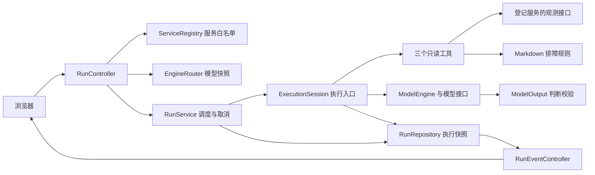
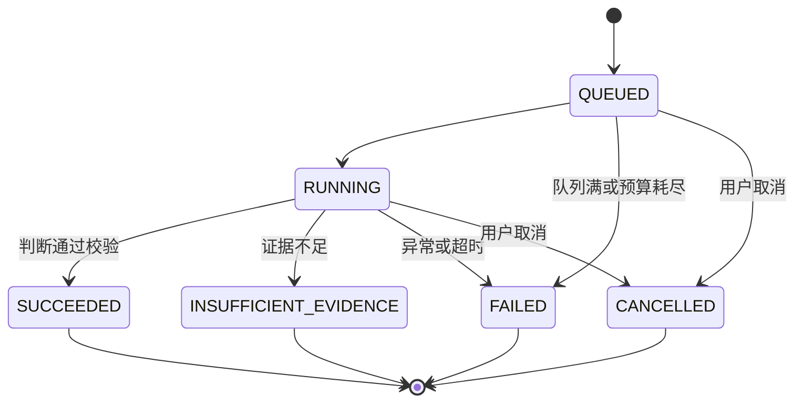

# 架构

Agent Triage 是 Spring Boot 应用，前端使用原生 HTML／JavaScript，通过 JDBC 保存执行和模型设置。订单、库存和数据库样例分别在独立 JVM 中运行，Agent 通过固定的只读 HTTP 契约读取观测。

## 模块关系

`ServiceRegistry` 决定可以访问哪些服务；`EngineRouter` 决定本次使用固定规则还是当前模型。二者的配置在提交时冻结。模型选择只读工具，工具和模型的实际执行都经过 `ExecutionSession`，不能绕过次数、时限或取消检查。

[Spring Boot Starter](STARTER.md)运行在业务应用内，只负责有界内存采样和观测接口；它不依赖 Agent 的模型或执行库。独立商品应用使用 HTTP 过滤器与 RestClient 定制器，价格应用使用 JDBC 回调与 HikariCP 采样，分别提供 HTTP V1 与数据库 V2 数据。

## 工作区查询

`RunRepository` 每次保存时在同一行原子更新 JSON 与历史查询列。数据库 V3 为服务、模式、问题、耗时与用量增加投影；`HistoryRepository` 启动时分批回填旧记录，不重写原 JSON。

历史分页使用数据库创建时间与 ID 游标，保留不同数据库的时间精度；过滤参数进入预编译 SQL。删除只匹配已结束状态，正在执行的行不会被删除。统计使用同一数据库快照，分别保留完整、部分已知与缺失用量。

`ObservationStatusService` 在独立、有界的线程池中读取白名单服务接口，缓存五秒；它不依赖模型快照，也不发送业务流量。[工作区接口与使用方法](WORKSPACE.md)另见说明。

## 提交到完成

1. `RunController` 校验问题、服务和窗口。未知服务、超出该服务上限的窗口，在访问观测和模型之前拒绝。
2. `RunService` 冻结 `ToolContext` 与推理引擎快照。窗口结束时间为提交时刻，工具共享同一个起止时间；`expectedSelection` 防止旧页面悄悄提交给已切换的模型。
3. 创建 `QUEUED` 记录并进入协调队列。整体时限从提交时开始，包含排队时间。
4. 固定规则模式按顺序调用三个工具；模型模式用 Spring AI `ChatClient` 请求模型，校验整批工具参数后执行，再把结果传回下一轮。
5. 判断通过观测、规则和引用校验后保存结论；不足、失败或取消分别保留相应终态。浏览器通过 SSE 读取事件及完整记录。

模型的内部自动工具执行被关闭。`ModelTools` 只注册 `search_runbooks`、`read_service_metrics`、`query_error_logs`，参数中的服务与窗口必须逐字匹配本次上下文，不能附加 URL、SQL 或命令。

## 观测与判断

判断模式和观测来源分开配置。`DEMO` 使用固定规则，`MODEL` 使用模型选择；`SYNTHETIC` 提供固定的订单演示数据，`LIVE` 读取实际请求观测。固定规则模式也能使用 LIVE 数据。

| 协议 | 接口 | 用途 |
|---|---|---|
| `LAB` | `/lab/scenario`、`/lab/observations` | 兼容首版订单样例，冻结提交时的实验场景 |
| `OBSERVATIONS_V1` | `/triage/observations` | HTTP 下游请求窗口，不要求实验控制接口 |
| `DATABASE_V2` | `/triage/observations` | 单独记录获取连接与 SQL 阶段，以及连接池采样 |
| `OBSERVATIONS_V3` | `/triage/endpoint-observations` | MVC 接口窗口、处理方法、可选异常位置与响应分类 |
| `HTTP_REQUESTS_V4` | `/triage/request-observations` | 无下游配置的入站请求，保留接口与可选响应分类 |

观测地址来自启动时的白名单，只接受带端口的回环 HTTP 地址，可包含经过校验的上下文路径。V2 的 JPA 别名读取固定的 `/triage/database-observations`。`LiveObservationClient` 拒绝重定向和过大的响应，核对身份、版本、严格时间范围、计数和有限数值。HTTP 与数据库指标分别展示，数据库错误不会转换成 HTTP 下游超时率。

V4 服务不登记下游身份，窗口和接口摘要省略下游指标。页面保留“未采集”，模型和固定规则不把它当作零超时；接口及错误位置仍可参与本机源码核对。入站证据目前通过应用门槛返回证据不足，请求执行阶段失败判断另行实现。

HTTP 成功判断需要有请求、匹配的超时或无超时指标、错误日志以及对应规则。数据库耗尽判断还需要同次采样的池满与等待重叠，及明确的获取连接超时事件；SQL 查询失败不能替代。指标与日志的数据库窗口计数须一致。

`ModelOutput` 接收固定判断类型、证据 ID 和候选检查项，不接收自由诊断正文。应用生成关键措辞、按证据排列有效检查项并展示前两项，同时保存原始选择。`EvidenceValidator` 检查观察和原因是否引用本次实际返回的证据。没有超时的窗口不等于整个服务健康，池满也不能直接证明连接泄漏。

## 规则和证据门槛

`RunbookSearchTool` 按协议选择规则版本：合成订单、订单 LIVE、通用 HTTP V1 和数据库 V2。每组共享证据边界说明。检索使用关键词，LIVE 额外返回本服务的基础参考规则，并标明关键词命中或服务参考召回；文档不能证明当前状态。

明显无关的问题由 `QuestionScope` 先行拒绝，记录 `SCOPE_GATE`。模型请求后，若窗口没有请求，应用记录 `EVIDENCE_GATE` 并跳过最终模型生成；已有观测但查询到的文档缺少对应规则时，也返回证据不足。

整批工具参数首次无效时允许一次有界更正；必需证据或引用不完整时，只有预算足够才反馈一次。两个反馈都不提高原有轮次、工具数或时限。证据齐全后使用 `tool_choice=none`，要求模型从已有证据选择最终结果。[模型判断契约](MODEL_OUTPUT.md)列出解析与校验规则。

## 执行与超时

协调、工具和模型各使用有界线程池，分别为 4 个线程、16 个等待位。协调队列满返回 HTTP 429；工具和模型工作队列满会保存对应失败，不会无限创建线程。

默认上限为 3 次工具调用、4 轮模型、单工具 2s、单模型 20s、整体 60s。每步使用单次时限与剩余总时限的较小值，通过单调时钟检查预算。页面模型配置可以改变模型的轮次和响应时限，整体执行上限仍然生效。

协调线程负责常规推进，取消请求也会修改执行状态。`RunControl` 让步骤注册、结果写入、取消和终态提交共用 `MutableExecution` 的监视器，避免完成与取消同时覆盖记录。取消先保存 `CANCELLED`，再中断当前 Future 并移除队列任务；后续步骤和迟到结果检查取消标记，不能继续写入。

取消保留证据、事件和已知用量，清空最终结论，不记录为执行失败。重复取消不增加事件，已经结束的记录返回原结果。`Future.cancel(true)` 是中断请求，不响应中断的代码仍可占用工作线程；数据库 I/O 和 JVM 调度也不受等待时限硬性约束。远端模型可能继续计算并计费。[取消与用量](RUN_CONTROLS.md)说明这些边界。

## 存储、推送与重启

`RunRepository` 为每次执行保存一行 JSON 快照，包含状态、事件、证据、模型来源、用量与结果。状态列和 JSON 在同一条 SQL 中更新。H2 和 PostgreSQL 使用相同的 JDBC 代码与 Flyway 迁移；默认 H2 文件库便于本地启动，PostgreSQL 由独立 CI 作业验证。

`RunEventController` 每 200ms 读取快照，按事件序号推送尚未发送的事件，终态发送完整记录后关闭 SSE。支持 `Last-Event-ID` 重放，最多 64 个连接；浏览器断开不会取消任务，也不会触发新模型调用。前端按序号去重，模型响应后刷新已持久化的用量和证据。

启动时把未结束的 `QUEUED` 和 `RUNNING` 记录保存为 `FAILED / SERVER_RESTARTED`，保留证据，不自动重跑。已取消和其他终态保持原样。该恢复只适用于单实例；多个实例共用历史库时，需要任务归属或租约，才能区分仍在别处执行的任务。

每次事件更新会重写 JSON。完整历史列表使用投影列筛选和分页，执行详情再读取快照；统计由 SQL 聚合完成。页面支持预览后手动清理旧终态记录，默认不自动删除。大规模事件写入和历史存储的成本还需另行测量。

## 模型配置与用量

`ProviderRegistry` 保存模型服务和当前选择。`EngineRouter` 为新任务获取不可变引擎快照，因此切换模型不会改变已提交任务。未保存页面选择时，回退到环境配置。

模型使用 OpenAI 兼容的 Chat Completions，通过 `ModelConfiguration` 创建 Spring AI 客户端。页面提供百炼、GLM、Kimi、DeepSeek 等预设；供应商路径和非思考参数按设置处理。当前客户端不自动重试，HTTP 错误仅保存状态码说明，不回显原始响应。

输入包含问题、工具描述、本次证据和应用提供的约束反馈，不读取其他执行的历史。模型原始消息只保存在本次内存中，数据库不保存完整模型对话；结构化选择和应用生成的结论会保存。

响应与用量在同一个执行锁内记录。`knownUsage` 累加返回完整计数的轮次，`completedCalls` 和 `usageReportedCalls` 表明覆盖程度；缺失、超时和取消等待不会当作零。只有全部已启动轮次返回完整用量，`usage` 才有总计。Token 数值不等于服务方最终费用。

模型 API Key 在数据库中以 AES-GCM 密文保存，本地密钥默认位于 `data/model-config.key`。读取接口只返回 Key 是否存在；密钥丢失时不会自动重建并覆盖旧配置。输入问题和观测可能发送给所选模型服务，接入方需先去除凭据和业务敏感字段。

## 代码入口

| 文件 | 职责 |
|---|---|
| [RunController](../src/main/java/io/github/mochiuaena/triage/api/RunController.java) | 创建、查询和取消执行 |
| [ServiceRegistry](../src/main/java/io/github/mochiuaena/triage/tools/ServiceRegistry.java) | 启动白名单、协议、窗口与实验权限 |
| [RunService](../src/main/java/io/github/mochiuaena/triage/execution/RunService.java) | 调度、终态提交和重启恢复 |
| [RunControl](../src/main/java/io/github/mochiuaena/triage/execution/RunControl.java) | 跟踪可取消任务及当前步骤 |
| [ExecutionSession](../src/main/java/io/github/mochiuaena/triage/execution/ExecutionSession.java) | 执行预算、证据合并、事件与用量 |
| [ModelTools](../src/main/java/io/github/mochiuaena/triage/model/ModelTools.java) | 工具 schema 与整批参数校验 |
| [ModelOutput](../src/main/java/io/github/mochiuaena/triage/model/ModelOutput.java) | 判断、引用和检查项校验 |
| [EvidenceRules](../src/main/java/io/github/mochiuaena/triage/execution/EvidenceRules.java) | 协议对应规则与数据库事实条件 |
| [RunRepository](../src/main/java/io/github/mochiuaena/triage/store/RunRepository.java) | JSON 执行快照的持久化 |
| [RunEventController](../src/main/java/io/github/mochiuaena/triage/api/RunEventController.java) | SSE 推送与重放 |

项目使用 Java 21、Spring Boot 3.5.16、Spring AI 1.1.8、Maven 3.9.11。接口细节见 [API](API.md)，实际覆盖范围见[测试说明](VALIDATION.md)。
