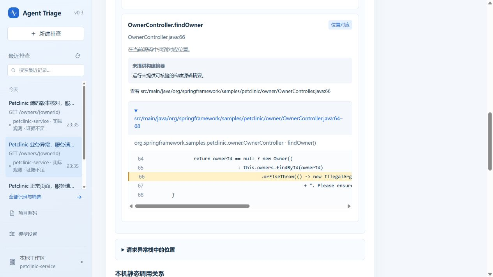

# Spring Petclinic 本地验收

2026-09-29，Windows，JDK 21，使用官方 Petclinic 提交 `67643c4137eb75bfeb177b427f8459c471bdcbd8`。仅增加 POM 的 24 行接入配置，业务源码在验证结束后与上游一致。构建成功；未运行上游完整测试套件。

| 检查 | 结果 |
|---|---|
| 本机索引 | 43 个 Java 文件，216 个符号，语法错误 0 个 |
| 实际请求 | 正常页 2 次、正常详情 2 次、不存在的主人详情 2 次；后两次返回 500 |
| 接口范围 | `GET /owners/new` 与 `GET /owners/{ownerId}` 分开统计，分别 2 次和 4 次 |
| 超时 | 两个窗口均为 0，没有下游 HTTP 超时 |
| MVC 入口 | `OwnerController.showOwner(int)` 匹配，构建源码摘要一致 |
| 业务异常 | 采集两条 `REQUEST_EXCEPTION`，`findOwner` 对应源码第 66 行；lambda 帧未匹配 |
| 摘要边界 | MVC 入口可核对；普通异常位置摘要未知，接入检查保持部分完成 |
| 源码变更 | 增加注释并重新索引后返回源码版本不同，不展开调用关系；恢复后入口摘要一致 |
| 历史 | 正常、异常与版本差异三条快照保留，重新索引没有改写旧结果 |
| 模型与数据 | `DEMO + LIVE`，模型调用 0；未使用原工作区的配置或历史 |

首次检查发现普通请求异常的摘要和建议写成了“下游请求错误”。已将未归因错误改为“请求错误”，保留证据不足与归因未知，并补充 HTTP 回归和公开项目检查。v0.3.0 标签与附件保持发布时内容，这项修订在 main 的后续提交中。

结果覆盖公开项目的原有 MVC 业务请求、异常和源码关联。JPA、SQL 与连接池原因还需要各自的观测证据；后续继续补充 JPA 接入、lambda 位置匹配和普通异常位置的版本核对。

[普通请求错误与证据不足页面](../assets/petclinic-overview.png)保留了本次判断的边界。修订后主项目 253 项回归无失败，Windows 下 1 项符号链接权限检查跳过；公开项目的实际请求、源码差异和历史检查重新通过，模型调用仍为 0。

复现步骤见[接入说明](../PETCLINIC.md)。原始执行、日志和公开项目副本留在本机忽略目录中，报告不包含它们。
