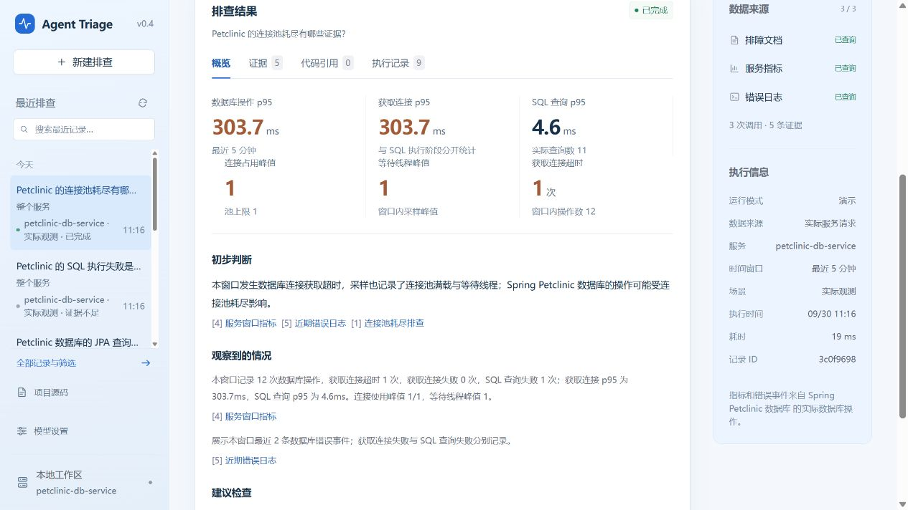

# Spring Petclinic JPA 观测验收

2026-09-30，Windows，JDK 21；Petclinic 固定在官方提交 `67643c4137eb75bfeb177b427f8459c471bdcbd8`，仍使用 Spring Boot 3.5.0 与 H2。原业务文件没有改动：本机副本只增加 POM 接入项和[观测配置类](../../verification/petclinic/PetclinicTriageConfiguration.java)。该类在验收时把 Hikari 数据源交给 v0.4.0 Starter，并提供两个默认关闭的本机测试入口。

| 检查 | 实际结果 |
|---|---|
| 原有 HTTP 请求 | 正常页面 2 次、正常主人详情 2 次、不存在的主人详情 2 次；异常详情返回 500 |
| 源码 | 索引 44 个 Java 文件、223 个符号，语法错误 0 个；MVC 入口摘要一致 |
| 普通业务异常 | `OwnerController.findOwner` 对应第 66 行；lambda 帧仅为方法候选，两个位置的构建摘要仍未知 |
| 原有 JPA 查询 | 业务请求窗口记录 10 次 JDBC 执行，获取连接超时和 SQL 执行失败均为 0 |
| SQL 阶段测试 | 本机测试入口执行无效查询并返回 503；数据库服务记录 `SQL_QUERY_FAILED` 1 次，获取连接超时为 0，判断为证据不足 |
| 连接获取测试 | 测试入口短暂持有唯一连接，原有 `/owners/1` 请求在获取连接阶段失败；记录 `DB_CONNECTION_ACQUIRE_TIMEOUT` 1 次，池满且有等待的采样 5 次 |
| 恢复 | 持有连接释放后，原有 `/owners/1` 再次返回 200，数据库查询计数继续增加 |
| 排查与费用 | 数据库服务保存正常、SQL 失败、连接获取超时三条记录；状态依次为已完成、证据不足、已完成。全部使用 `DEMO + LIVE`，模型调用 0 |

这里的数据库 `requestCount` 是被观测的 JDBC 操作数，不能与 HTTP 请求数直接相加。包装数据源只在匹配的同步业务请求线程记录连接获取和 `Statement.execute*`，不会保存 SQL、参数或异常消息。池占用采样以 50 ms 间隔进行，本机样本数会随调度变化；验收要求池满与等待重叠，不依赖固定采样次数。

SQL 错误由验收配置中的固定无效查询触发，连接持有也由该配置短暂触发；它们不属于 Petclinic 原有业务流程，Agent 的诊断工具没有控制这些操作。连接池耗尽判断还需要对应的超时错误事件和规则；单独的 SQL 错误没有被误报为连接池耗尽。

普通异常的原始栈没有可核验的类加载器引用，源码版本仍保持未知；JPA 的结果集遍历、过滤器之外的任务和绕过包装数据源的调用也不在本次范围。记录了实际症状后，仍需业务侧检查事务、持有连接的请求和 SQL 执行计划才能确定内部根因。

复现命令见[Petclinic 接入说明](../PETCLINIC.md)。运行数据库、密钥、日志和原始执行 JSON 均保存在被忽略的 `target/`，没有提交到仓库。

[单独 SQL 错误的证据不足结果](../assets/petclinic-jpa-sql.png)与[两类错误事件](../assets/petclinic-jpa-evidence.png)保留了页面上的阶段区别。

[Windows、Linux、PostgreSQL 与 LIVE 协议回归](https://github.com/MoChiUaena/agent-triage/actions/runs/36664286042)在功能提交上全部通过；[独立 Petclinic Linux 验收](https://github.com/MoChiUaena/agent-triage/actions/runs/36664167624)还检查了两种数据库故障和验证进程的停止流程。
