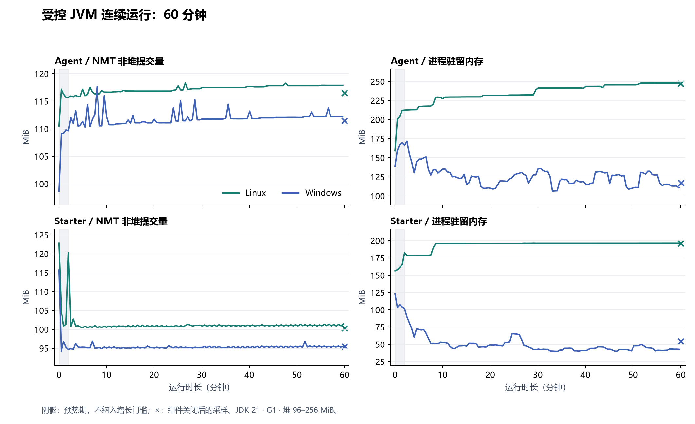

# 一小时资源验收

本次在 Windows 与 Linux 分别运行 Agent 和 Starter 的受控流程。四个作业各运行 3600 秒，使用 JDK 21、G1、96–256 MiB 固定堆范围和 NMT summary；每 30 秒采样同一测试 JVM，前 120 秒作为预热期。

- 源码：`1f6811831f4772100ba33dadde31723bb8453d9c`。
- 一小时工作流：[37004555866](https://github.com/MoChiUaena/agent-triage/actions/runs/37004555866)。
- 60 秒前置检查：[37004228144](https://github.com/MoChiUaena/agent-triage/actions/runs/37004228144)。
- 300 秒复查：[37005290440](https://github.com/MoChiUaena/agent-triage/actions/runs/37005290440)，源码 `d096b7d02b8da1e138f9ef2ffc013ea9124d5947`。

Windows 运行器为 `windows-2025-vs2026`，setup-java 解析版本 `21.0.12+101.0`；Linux 为 `ubuntu-24.04`、`21.0.12+1`。四个作业于北京时间 2026-10-02 20:04 启动，21:05 完成；其中每条 JVM 工作负载持续 3600 秒。

## 实测

| 组件 | 系统 | 运行采样数 | 完成轮数 | GC 后堆增加 MiB | 非堆上浮 MiB | RSS 上浮 MiB | NMT 线程 峰值／关闭 |
|---|---|---:|---:|---:|---:|---:|---:|
| Agent | Linux | 120 | 11,833 | 0.89 | 2.60 | 35.39 | 37 / 23 |
| Agent | Windows | 120 | 11,133 | 1.00 | 8.00 | 5.27 | 38 / 23 |
| Starter | Linux | 120 | 340,830 | 0.18 | 0.00 | 13.81 | 31 / 23 |
| Starter | Windows | 120 | 239,278 | 0.34 | 2.21 | 0.00 | 31 / 23 |

| 组件／系统 | 非堆基线 MiB | 关闭后非堆 MiB | RSS 基线 MiB | 关闭后 RSS MiB | 关闭后私有提交量 MiB |
|---|---:|---:|---:|---:|---:|
| Agent / Linux | 115.70 | 116.52 | 212.57 | 247.06 | 未采集 |
| Agent / Windows | 109.66 | 111.47 | 166.48 | 117.20 | 239.02 |
| Starter / Linux | 120.30 | 100.36 | 182.65 | 196.01 | 未采集 |
| Starter / Windows | 94.68 | 95.50 | 101.66 | 54.38 | 203.70 |



四条稳态采样的最大间隔为 30.15–30.19 秒，关闭标记为 3600.13–3600.56 秒，满足 35 秒空缺上限。表中内存上浮包含关闭样本。

Linux Agent 的 RSS 仍呈台阶增长；稳态末 10 个样本与首 10 个样本的中位数相差 34.80 MiB，NMT 非堆对应变化为 1.91 MiB。Windows Agent 的 RSS 中位数下降 34.71 MiB，但私有提交量中位数增加 13.81 MiB。总量采样不足以解释这些变化的分配来源，数天运行还需继续核对。

## 工作量与清理

Agent 每轮交替取消工具或可控模型流程。四个运行中任务与一个排队任务被取消后，新任务仍能结束；迟到结果不改变已取消记录。每轮检查登记、三个执行器队列与借用连接；结束后确认三个执行器终止。测试只删除自己创建的终态记录，没有测试业务历史长期积累。

Starter 每轮完成一个 Spring 测试异步请求，记录正常／失败 SQL 两次 JDBC 观测，取消等待任务，完成请求后再执行迟到查询并确认不增加计数。四个工作线程分别检查上下文归还；HTTP／JDBC 样本各最多 512 条，容量淘汰后的不完整窗口返回 422。每三轮一次 503，其余为 204；单纯 503 计入服务器错误，不计为请求执行异常。关闭观测器后采样线程终止，测试结束时另关闭应用拥有的连接池。

| 组件／系统 | 取消任务 | 新任务完成 | 请求完成 | JDBC 观测 | 清理结果 |
|---|---:|---:|---:|---:|---|
| Agent / Linux | 59,165 | 11,833 | — | — | 登记／队列／连接为 0，执行器终止 |
| Agent / Windows | 55,665 | 11,133 | — | — | 登记／队列／连接为 0，执行器终止 |
| Starter / Linux | 340,830 | — | 340,830 | 681,660 | 上下文／连接为 0，采样线程终止 |
| Starter / Windows | 239,278 | — | 239,278 | 478,556 | 上下文／连接为 0，采样线程终止 |

## 失败与修正

首次 [60 秒](https://github.com/MoChiUaena/agent-triage/actions/runs/37003615893)与[300 秒](https://github.com/MoChiUaena/agent-triage/actions/runs/37003612501)检查均在诊断解析处失败。补充数值错误上下文后，[第二次 60 秒](https://github.com/MoChiUaena/agent-triage/actions/runs/37003926856)与[300 秒](https://github.com/MoChiUaena/agent-triage/actions/runs/37003924273)明确显示 CI JDK 输出 `(threads #28)`，本机 JDK 输出 `(thread #28)`。解析原来只接受单数标签。

`1f68118` 增加这两种标签的兼容和实际 CI 数值回归，没有降低内存门槛。后续 `d096b7d` 还拒绝稳态首尾缺少采样的结果。一小时作业在前一提交启动，下载后使用更新后的规则重放全部原始 CSV，并核对同一 JVM、源码、3600 秒、干净工作区及资源计数。旧汇总先按原来的运行阶段定义核对，再重算包含关闭样本的增长量；本记录采用后者。补充复核工具的测试还覆盖四平台矩阵缺失／重复、汇总与 CSV 不一致、缺少平台数值和错误清理结果。

代码审查另复现了三个验收工具的缺口：关闭样本绕过增长门槛、汇总只检查最终 GC 堆值、Windows 只终止包装命令壳而留下 Maven 子进程。`91ae571` 将关闭样本纳入原有门槛，检查 GC 峰值与最终值，并终止自己启动的包装进程树。真实进程回归确认相关子进程退出，无关进程仍存活。采样调度余量也由 30 秒收紧至 5 秒，小时检查会拒绝超过 35 秒的稳态空缺。18 项 Python 回归通过；这些修正针对验收工具，不表示本次发现了新的业务组件泄漏。

修正后的五分钟复查 [37009900465](https://github.com/MoChiUaena/agent-triage/actions/runs/37009900465)中，三个资源作业通过，Windows Starter 在辅助进程测试读取未写完的 PID JSON 时失败，工作负载未启动。`b2c5f68` 将夹具 PID 文件改为关闭后原子发布，失败路径也清理自己的进程树；最终复查记录见下方。

最终 [300 秒复查 37010672257](https://github.com/MoChiUaena/agent-triage/actions/runs/37010672257)在 `b2c5f68f62af82b0e352400dca8c573aa73aad7b` 上四个资源作业全部通过，附件按包含关闭样本的定义重放通过。同一提交的[常规 CI 37010672202](https://github.com/MoChiUaena/agent-triage/actions/runs/37010672202)首轮在 Windows 下载 Maven 3.9.11 时失败，Starter 测试尚未启动；只重跑失败作业后，Windows/Linux、PostgreSQL 及本地模型协议集成全部通过。

## 数据与范围

CI 只上传数值 CSV 和汇总，保留 14 天。本记录另保存四份数值 [CSV](samples/2026-10-02-resource-soak/) 与 SHA-256，内存曲线从同一批数据生成。日志、数据库、模型设置和外部源码未加入这批样本。

| CSV | SHA-256 |
|---|---|
| [agent-linux.csv](samples/2026-10-02-resource-soak/agent-linux.csv) | f9855ce0cef7a453e46838d7092b54ab0249eaec4307ca3fa7bdec29eac6a8a5 |
| [agent-windows.csv](samples/2026-10-02-resource-soak/agent-windows.csv) | e3dfa003b0e1003cb93b5725826f2fdfad643a9f43f04f88664795117ecff10c |
| [starter-linux.csv](samples/2026-10-02-resource-soak/starter-linux.csv) | 465759f9c369016acb1712189ccf51b03467e21c15a5ae84f6cead2f3b5ef4b6 |
| [starter-windows.csv](samples/2026-10-02-resource-soak/starter-windows.csv) | 363117c1f1cd1e454f9c029b5766b0066ece9c399433f3f38cece3a78ce0ca68 |

仓库内 CSV 可以直接复算采样覆盖和增长量。运行轮数、源码及清理断言仍应核对上面的工作流；完整附件的复核命令要求同时提供数值汇总。

```python
import sys
from pathlib import Path
sys.path.insert(0, "scripts")
from resource_report import read_samples
from resource_soak import summarize

for sample in sorted(Path("docs/validation/samples/2026-10-02-resource-soak").glob("*.csv")):
    system = "windows" if "windows" in sample.name else "linux"
    result = summarize(read_samples(sample, system), 3600, 120, 30)
    print(sample.name, result["postWarmupPeakNativeGrowthBytes"],
          result["postWarmupPeakResidentGrowthBytes"])
```

NMT 非堆提交量的稳态上浮门槛为 64 MiB，RSS 为 128 MiB；Java 测试的 GC 后堆留存门槛为 64 MiB。NMT、进程驻留量、采样堆使用量和 GC 后堆留存是不同读数；诊断命令依次读取，不能把它们当成同一时刻的内存分解。

这次是 Maven／JUnit 内的连续组件流程，未测完整 HTTP 服务的端到端吞吐、真实模型供应商取消、生产数据库驱动、业务历史增长或数天运行。通过本次门槛表示这些流程在一小时内完成并归还了已检查的资源，不能据此声称生产环境没有内存泄漏。

复核方法见[持续运行资源检查](../RUNTIME_RESOURCES.md)。
