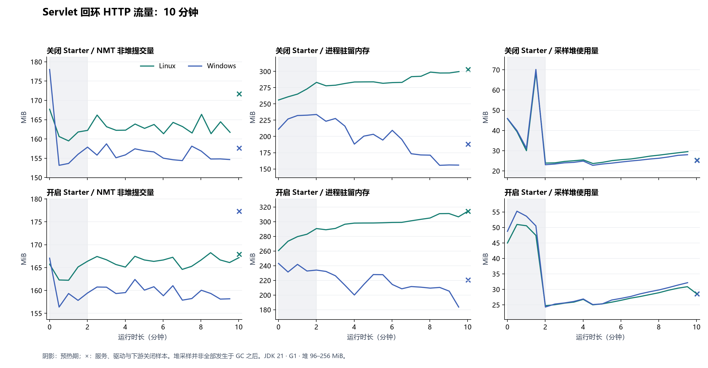

# 真实 HTTP 服务资源验收

在随机回环端口的 Servlet 应用和下游服务中，以同一组请求对比 Starter 关闭、开启后的资源增长。负载驱动、应用和下游都在同一个 Maven/JUnit 测试 JVM 中。

- 源码：`a9b87ca8c146a098e15e86cfce7122be46470349`。
- 60 秒验收：[37091214184](https://github.com/MoChiUaena/agent-triage/actions/runs/37091214184)，Windows/Linux 四组通过，附件已独立重放。
- 每秒 8 次请求，驱动并发度 4；三个正常 GET/POST/PUT、三个 Simple 响应头超时、一个 Simple 正文超时和一个 JDK 正文读取失败。
- 正常返回延迟 350 毫秒，读取预算 2 秒；故障请求读取预算 250 毫秒，下游等待 1 秒。JDK 正文失败没有可靠的超时异常类型，单独计数。

下方早期 60 秒与十分钟数据使用原共享池策略 1。当前夹具已改为故障连接关闭策略 2；旧数据不能替代新策略验收。

修正下游清理及窗口等待后的最新四组结果见[长时运行复验](2026-10-03-http-window-audit.md)。

## 早期 60 秒结果（策略 1）

每组完成 480 请求、180 正常返回和 300 个预设失败；240 次有类型超时和 60 次无类型正文失败。420 个已取得的响应全部关闭，POST/PUT 正文一致，上下文审计无残留。关闭后两 HTTP 客户端终止、执行器和队列归还、Servlet 与下游原端口不再接收连接。

| Starter | 平台 | 观测请求 / 超时 | 最后一分钟请求 / 超时 | GC 后堆变化 MiB | NMT 非堆增长 MiB | RSS 增长 MiB |
|---|---|---:|---:|---:|---:|---:|
| 关闭 | linux | 0 / 0 | 0 / 0 | -0.31 | 13.51 | 4.58 |
| 关闭 | windows | 0 / 0 | 0 / 0 | -1.10 | 16.60 | 17.40 |
| 开启 | linux | 480 / 240 | 474 / 237 | 0.41 | 5.62 | 9.45 |
| 开启 | windows | 480 / 240 | 474 / 237 | 0.48 | 5.85 | 7.34 |

关闭组不安装观测器，表中零表示没有生成观测记录。尾部窗口按已完成请求核对，最早的请求可自然过期；累计请求和超时仍要求完整。各组都有运行与关闭样本，NMT 非堆 64 MiB、RSS 128 MiB、GC 后堆 64 MiB 门槛未超限。

## 早期十分钟结果（策略 1）

第三轮 [37092085088](https://github.com/MoChiUaena/agent-triage/actions/runs/37092085088) 四组通过，源码为 `4ba99cc0efe23726be50c785c59cd88a69d39300`，原始附件已独立重放。每组完成 4800 请求、1800 正常返回、3000 预设失败；2400 次有类型超时和 600 次无类型正文失败。4200 个响应全部关闭，关闭与上下文断言通过。

| Starter | 平台 | 观测请求 / 超时 | 最后一分钟请求 / 超时 | GC 后堆变化 MiB | NMT 非堆增长 MiB | RSS 增长 MiB |
|---|---|---:|---:|---:|---:|---:|
| 关闭 | linux | 0 / 0 | 0 / 0 | 3.76 | 10.71 | 43.54 |
| 关闭 | windows | 0 / 0 | 0 / 0 | 3.87 | 3.49 | 0.63 |
| 开启 | linux | 4800 / 2400 | 466 / 233 | 6.02 | 5.40 | 44.05 |
| 开启 | windows | 4800 / 2400 | 473 / 237 | 6.16 | 5.15 | 0.93 |

每组 20–21 个运行样本和一个关闭样本，排除前 120 秒预热。Linux 的 RSS 增长约 44 MiB，分配来源尚未核实；NMT 分项不等于完整 RSS 归因，十分钟通过也不能证明数天稳定。

本机同版本 JDK 的五分钟开启组另外通过了 2400 请求、1200 观测超时和 2100 响应关闭；这是本机单组核对，不替代跨平台矩阵。

## 故障连接隔离后的 60 秒结果（策略 2）

[37094574022](https://github.com/MoChiUaena/agent-triage/actions/runs/37094574022) 四组通过，源码为 `eb4d00a741a5ef9224c3f669ed5a9a8802d1e94a`。每组 480 请求、240 次有类型超时、60 次 JDK 无类型正文失败、420 个响应全部关闭；正常连接实际复用，Simple 故障请求和所有故障响应关闭连接。

| Starter | 平台 | 观测请求 / 超时 | GC 后堆变化 MiB | NMT 非堆增长 MiB | RSS 增长 MiB |
|---|---|---:|---:|---:|---:|
| 关闭 | linux | 0 / 0 | -0.20 | 16.52 | 9.93 |
| 关闭 | windows | 0 / 0 | -0.01 | 16.63 | 17.79 |
| 开启 | linux | 480 / 240 | 0.54 | 8.54 | 16.29 |
| 开启 | windows | 480 / 240 | 0.66 | 8.89 | 11.34 |

短验收尚不足以核对长时偶发连接故障。策略 2 的十分钟及小时检查需独立完成，不能与策略 1 的四组混合重放。

## 故障连接隔离后的十分钟结果（策略 2）

[37094935610](https://github.com/MoChiUaena/agent-triage/actions/runs/37094935610) 四组通过，源码为 `eb4d00a741a5ef9224c3f669ed5a9a8802d1e94a`。每组 4800 请求、2400 次有类型超时、600 次 JDK 无类型正文失败、4200 个响应全部关闭；正常连接实际复用，Simple 故障请求和所有故障响应关闭连接。

| Starter | 平台 | 观测请求 / 超时 | GC 后堆变化 MiB | NMT 非堆增长 MiB | RSS 增长 MiB |
|---|---|---:|---:|---:|---:|
| 关闭 | linux | 0 / 0 | 4.05 | 9.45 | 19.84 |
| 关闭 | windows | 0 / 0 | 4.10 | 0.85 | 0.00 |
| 开启 | linux | 4800 / 2400 | 6.08 | 1.87 | 23.66 |
| 开启 | windows | 4800 / 2400 | 6.34 | 17.88 | 0.00 |

这一修订的十分钟四组及附件重放通过；后续小时失败及新修订复验分别记录在下文和[长时运行复验](2026-10-03-http-window-audit.md)。策略 1 与策略 2 的数据不能混合重放。

曲线包含同一 JVM 的驱动、Servlet、观测器和下游；堆采样不全发生于 GC 之后。阴影为预热期，关闭样本以 × 标出。

## 首轮十分钟失败

[37090078761](https://github.com/MoChiUaena/agent-triage/actions/runs/37090078761) 的 Windows 两组通过，Linux 两组失败，不能作为整体验收通过记录。开启组约第 243 秒的正常请求收到 504；关闭组最终有类型超时为 2399，预期 2400。首轮源码为 `3633cdfe0aafe5ac5907378df0cf1b4dc7982920`。

原夹具所有请求共用 250 毫秒读取预算。350 毫秒正常延迟回归确认会被误判为失败，因此正常预算改为 2 秒，故障预算保持 250 毫秒，并加上实际发送延迟、GC 时间和异常类型诊断。第二轮 [37091375388](https://github.com/MoChiUaena/agent-triage/actions/runs/37091375388) 三组通过，但 Windows 开启组约第 240 秒有三个正常请求等待 2 秒后超时；诊断显示期间 GC 计时未增加。第三轮四组通过，前两轮底层延迟及类型差异仍未确定，不能用成功复跑证明问题已修复。

最新短测 [37093072901](https://github.com/MoChiUaena/agent-triage/actions/runs/37093072901) 还捕获正常 POST 在读取响应头时发生 Connection reset。现场中分发器在等待，故障处理线程在预设延迟，没有观察到锁阻塞；正常与故障请求共用 HttpURLConnection 池是待验证的来源。当前策略让故障连接不再返回池，并保留正常连接复用的断言。不能仅据旧策略的一次通过认定问题已解决。

## 一小时首次验收（未通过）

[37096173643](https://github.com/MoChiUaena/agent-triage/actions/runs/37096173643) 使用源码 `88a5c26b96deee9920e4ff449257b316ea22f93d`。Windows 关闭组约 16 分钟、开启组约 21 分钟在 Maven 工作负载失败后退出；输出失败尾部时，Python 的 cp1252 编码又因替换字符报错，原始失败原因没有完整输出。因此该轮不能作为四组通过结果。

错误输出已增加安全编码回归，夹具自身断言也保留调用位置。[二十分钟诊断](https://github.com/MoChiUaena/agent-triage/actions/runs/37098109735) 四组通过，但不能替代小时验收。

修正下游写入失败的清理路径后，[第二次小时验收](https://github.com/MoChiUaena/agent-triage/actions/runs/37099843560) 三组通过，Windows 开启组约第 1310 秒失败。驱动请求超过 5 秒，三个正常业务请求超过 2 秒；GC 计时未增加，下游八个工作线程在预设等待中，队列有一个任务。现场没有确定退出原因，该轮仍未通过。

另外，窗口检查原先用轮询等待完成时间远离一分钟边界，可能长时间暂停发送后再集中补发。密集完成记录的回归测试复现了等待。现在直接计算查询边界，最多向前移一秒；找不到安全边界就明确失败，累计计数及过期窗口仍完整检查。这是夹具中的独立缺陷，尚不能归因于上次小时失败。

## 测量边界

两组使用独立 CI 虚拟机，GC 时点不同，资源差值不能直接当作 Starter 的生产开销。NMT 分项已保存，但 RSS 增长的分配来源仍需核对；真实业务吞吐、远程网络和数天稳定性不在这条固定故障比例负载中。运行与重放方式见 [资源检查](../RUNTIME_RESOURCES.md)。

## 原始数值

CSV 和 JSON 保留附件原始字节，summary.json 包含源码、平台、计数和关闭结果；未加入 Maven 日志、业务数据或模型设置。

| 文件 | SHA-256 |
|---|---|
| [samples/2026-10-03-http-resources/60s/http-disabled-linux/memory.csv](samples/2026-10-03-http-resources/60s/http-disabled-linux/memory.csv) | 7700ec2bf8dac2a6520432b2aeba7cd23110a84107022cea781d3ed9deb298d6 |
| [samples/2026-10-03-http-resources/60s/http-disabled-linux/summary.json](samples/2026-10-03-http-resources/60s/http-disabled-linux/summary.json) | c791ac658d13e0b3e6cc9f1e689dbacec28552c7793ef3e4f803c9ac0f6ba181 |
| [samples/2026-10-03-http-resources/60s/http-disabled-windows/memory.csv](samples/2026-10-03-http-resources/60s/http-disabled-windows/memory.csv) | 6c9623ca9d0c76d3cbd38994da1453b6a0a3f5d5968cf4c17f7d1562f66e555d |
| [samples/2026-10-03-http-resources/60s/http-disabled-windows/summary.json](samples/2026-10-03-http-resources/60s/http-disabled-windows/summary.json) | 071cd60025db70b04f8db4d7574bdaeefbc692b563f17afa4464252d5727c4a6 |
| [samples/2026-10-03-http-resources/60s/http-enabled-linux/memory.csv](samples/2026-10-03-http-resources/60s/http-enabled-linux/memory.csv) | 2ad5baaf8fc7da013c12fdd6854b43f37a7c613a024ce65ccebaaae12ccd40db |
| [samples/2026-10-03-http-resources/60s/http-enabled-linux/summary.json](samples/2026-10-03-http-resources/60s/http-enabled-linux/summary.json) | 26b32114f13d5315d4d46d1243e7d244d4840891351f4de511549f601697783a |
| [samples/2026-10-03-http-resources/60s/http-enabled-windows/memory.csv](samples/2026-10-03-http-resources/60s/http-enabled-windows/memory.csv) | 2b6eef690208d672e185382722713150d434ba883684b4dc7025169776d57ed5 |
| [samples/2026-10-03-http-resources/60s/http-enabled-windows/summary.json](samples/2026-10-03-http-resources/60s/http-enabled-windows/summary.json) | 0ca48fe339190dbd3992cfc874673ed1a50358e67407e30e5f9e9ba4b86e0b02 |

| [samples/2026-10-03-http-resources/600s/http-disabled-linux/memory.csv](samples/2026-10-03-http-resources/600s/http-disabled-linux/memory.csv) | 488c2655ba72ae7390369c476490b986a3dfdbebf354b60535434687dc92fdc4 |
| [samples/2026-10-03-http-resources/600s/http-disabled-linux/summary.json](samples/2026-10-03-http-resources/600s/http-disabled-linux/summary.json) | 2b7f35ee025ca905bae70cce72615ad1732605ee4e3da80dcc0afdf778dd2e9a |
| [samples/2026-10-03-http-resources/600s/http-disabled-windows/memory.csv](samples/2026-10-03-http-resources/600s/http-disabled-windows/memory.csv) | 3d995bb654f7fdcec93077d1053138fdcadd57cf4088ba246f98607deb8d8a22 |
| [samples/2026-10-03-http-resources/600s/http-disabled-windows/summary.json](samples/2026-10-03-http-resources/600s/http-disabled-windows/summary.json) | 2e8a6f94333205ada523ec9d7a83d54bb5bf80f27a1fe0e5e4258693ad363a99 |
| [samples/2026-10-03-http-resources/600s/http-enabled-linux/memory.csv](samples/2026-10-03-http-resources/600s/http-enabled-linux/memory.csv) | 90fe0bcb0e96bc44a7435c7dc5bfa4108ed9891f6939cd81db186957464c2747 |
| [samples/2026-10-03-http-resources/600s/http-enabled-linux/summary.json](samples/2026-10-03-http-resources/600s/http-enabled-linux/summary.json) | c2dfe8cc093b37036b59683d4640bb3ab23c9aafddd2aa9d6c9f7e231a4768aa |
| [samples/2026-10-03-http-resources/600s/http-enabled-windows/memory.csv](samples/2026-10-03-http-resources/600s/http-enabled-windows/memory.csv) | a360273907798d50f58057af0efbb447c9814e9c3c2f7edb24a87319c8e69b79 |
| [samples/2026-10-03-http-resources/600s/http-enabled-windows/summary.json](samples/2026-10-03-http-resources/600s/http-enabled-windows/summary.json) | 0a984e621d3add0e67956f08eea4d703752fdbabe9d03fdaf1f6def80841569f |

| [samples/2026-10-03-http-resources/policy-2/60s/http-disabled-linux/memory.csv](samples/2026-10-03-http-resources/policy-2/60s/http-disabled-linux/memory.csv) | db5b27aa1ecdf982812bfd5bf3c1da8ce6bca0672db62e156f451838534a06e6 |
| [samples/2026-10-03-http-resources/policy-2/60s/http-disabled-linux/summary.json](samples/2026-10-03-http-resources/policy-2/60s/http-disabled-linux/summary.json) | 8621276132fed575220af39898b55c90bf729c1ca0115f8a3fbb9c9d7a4b9d1a |
| [samples/2026-10-03-http-resources/policy-2/60s/http-disabled-windows/memory.csv](samples/2026-10-03-http-resources/policy-2/60s/http-disabled-windows/memory.csv) | f2639068fa9a51f0ed20601ba16532471223bd1ed5fd66e6c7bee72ea9b14825 |
| [samples/2026-10-03-http-resources/policy-2/60s/http-disabled-windows/summary.json](samples/2026-10-03-http-resources/policy-2/60s/http-disabled-windows/summary.json) | db3e6ac6ea2cc0ea7c060a60df85ac89d82def1e4e3ff71dd2841744cf8c9023 |
| [samples/2026-10-03-http-resources/policy-2/60s/http-enabled-linux/memory.csv](samples/2026-10-03-http-resources/policy-2/60s/http-enabled-linux/memory.csv) | 9e9716da175d8f233b66b627d8edd342e51071a2dbe78a22edfb9395d7e94972 |
| [samples/2026-10-03-http-resources/policy-2/60s/http-enabled-linux/summary.json](samples/2026-10-03-http-resources/policy-2/60s/http-enabled-linux/summary.json) | 50e340b3545704721c3f2e7dd40affb12891a3487e879b80d0162c592808351c |
| [samples/2026-10-03-http-resources/policy-2/60s/http-enabled-windows/memory.csv](samples/2026-10-03-http-resources/policy-2/60s/http-enabled-windows/memory.csv) | 35a34e0452c61982c84104cc8238cbdd3ce2bf3293295736f9888397462a115d |
| [samples/2026-10-03-http-resources/policy-2/60s/http-enabled-windows/summary.json](samples/2026-10-03-http-resources/policy-2/60s/http-enabled-windows/summary.json) | 655298fe5632eeae6a92e2575ab8fb0e551ec8176c9a15c127523b5bcde9fedd |

| [samples/2026-10-03-http-resources/policy-2/600s/http-disabled-linux/memory.csv](samples/2026-10-03-http-resources/policy-2/600s/http-disabled-linux/memory.csv) | 4ac622124c95e5a8b39e615795f65299781d9f81780f2497dfd82ca38d89ca62 |
| [samples/2026-10-03-http-resources/policy-2/600s/http-disabled-linux/summary.json](samples/2026-10-03-http-resources/policy-2/600s/http-disabled-linux/summary.json) | 3a1757840a4baff07aa0992b18665c39ead7084088fae7d06356c88d94ff80a4 |
| [samples/2026-10-03-http-resources/policy-2/600s/http-disabled-windows/memory.csv](samples/2026-10-03-http-resources/policy-2/600s/http-disabled-windows/memory.csv) | 5eb3a6c54bcd6b8f2e8195f3ce29081d71127d1c36a0f5ff503333e71b19dfd7 |
| [samples/2026-10-03-http-resources/policy-2/600s/http-disabled-windows/summary.json](samples/2026-10-03-http-resources/policy-2/600s/http-disabled-windows/summary.json) | 7a32f6f72bf65f23555e7b07e29265eb1e7d76212d85efda141b3b7c05fcb730 |
| [samples/2026-10-03-http-resources/policy-2/600s/http-enabled-linux/memory.csv](samples/2026-10-03-http-resources/policy-2/600s/http-enabled-linux/memory.csv) | 13309d6c88c0b07030d54ea81c3e13c695adf9ac72b9614530f47e90692599e2 |
| [samples/2026-10-03-http-resources/policy-2/600s/http-enabled-linux/summary.json](samples/2026-10-03-http-resources/policy-2/600s/http-enabled-linux/summary.json) | 29e629a1b1c41223465f56e7d50531b2f57674072320572e2b683fe0e9629b4d |
| [samples/2026-10-03-http-resources/policy-2/600s/http-enabled-windows/memory.csv](samples/2026-10-03-http-resources/policy-2/600s/http-enabled-windows/memory.csv) | 648b1ea04a1afc3126b98bd4f13df80d3af58ccf0239f6a9d009ec4993c50733 |
| [samples/2026-10-03-http-resources/policy-2/600s/http-enabled-windows/summary.json](samples/2026-10-03-http-resources/policy-2/600s/http-enabled-windows/summary.json) | 7fb15318139130865ebfae3d4118ed47f8bdac0f29cf6774ed6903e57e5154c8 |
