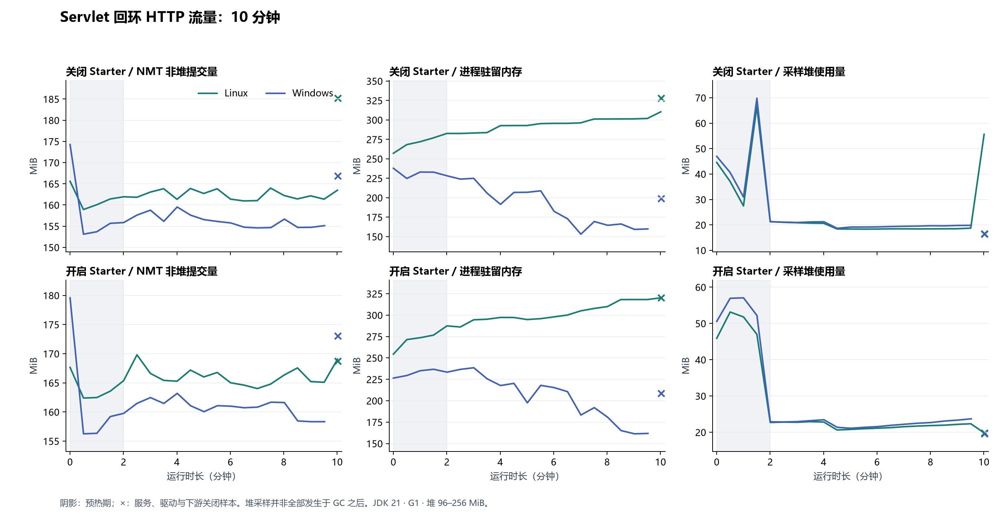
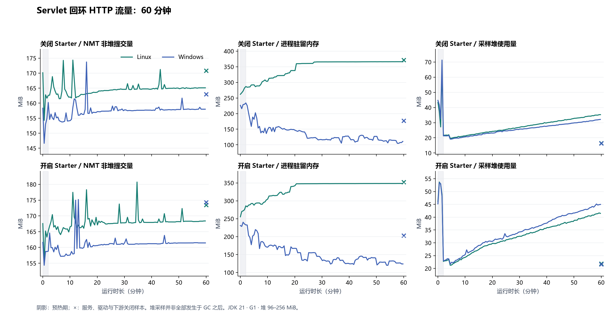

# HTTP 长时运行复验

源码 `bb3ace8a57a5be920612e69679f310728f64741a` 修正了两处验收夹具问题：下游写入失败交还 HttpServer 清理，窗口核对直接计算时间边界，避免轮询暂停发送。流量、超时预算、请求计数和资源门槛保持不变；故障连接关闭，正常连接仍验证复用。

[60 秒](https://github.com/MoChiUaena/agent-triage/actions/runs/37110851693)和[十分钟](https://github.com/MoChiUaena/agent-triage/actions/runs/37111025147)的 Windows/Linux 四组全部通过，数值附件已独立重放。十分钟每组完成 4800 次请求、2400 次预设超时、600 次无类型正文失败，4200 个响应全部关闭；上下文、执行器、队列和原监听端口的回收检查通过。

| Starter | 平台 | GC 后堆变化 MiB | NMT 非堆增长 MiB | RSS 增长 MiB |
|---|---|---:|---:|---:|
| 关闭 | Linux | -2.98 | 23.26 | 45.28 |
| 关闭 | Windows | -2.97 | 11.01 | 0.00 |
| 开启 | Linux | -0.98 | 4.44 | 32.74 |
| 开启 | Windows | -1.01 | 13.29 | 5.15 |

关闭后堆使用量低于初始基线，旧夹具的留存增长没有在这轮重现。两组运行在独立 CI 虚拟机，NMT 与 RSS 的差值不能直接归因于 Starter；Linux RSS 增长的分配来源仍未确定。

## 一小时结果

[37111670537](https://github.com/MoChiUaena/agent-triage/actions/runs/37111670537) 使用同一源码，Windows/Linux 四组全部通过，附件已独立重放。每组完成 28,800 次请求、14,400 次预设超时、3600 次无类型正文失败，25,200 个响应全部关闭。开启组的累计观测数完整，最终一分钟均为 475 次请求、237 次超时；窗口外的记录正常过期。

| Starter | 平台 | GC 后堆峰值增量 MiB | 关闭后 GC 堆变化 MiB | NMT 非堆增长 MiB | RSS 增长 MiB |
|---|---|---:|---:|---:|---:|
| 关闭 | Linux | 0.06 | -3.06 | 11.74 | 84.62 |
| 关闭 | Windows | 0.04 | -3.01 | 13.49 | 0.00 |
| 开启 | Linux | 1.96 | 1.07 | 15.52 | 66.49 |
| 开启 | Windows | 1.86 | 1.04 | 16.39 | 0.00 |

上下文、执行器、队列和原监听端口的回收检查通过。GC 后堆 64 MiB、NMT 非堆 64 MiB 和 RSS 128 MiB 的增长门槛均未超限，关闭阶段也纳入检查。Linux RSS 仍增长约 66–85 MiB，分配来源尚未确定；这轮结果覆盖固定故障比例的一小时回环负载，数天稳定性及真实业务吞吐另行验证。

曲线中的普通堆采样随运行时间上升，关闭后回落；它们不全发生在 GC 之后。上表的 GC 后峰值来自夹具定时主动 GC 后的独立核对，不能用曲线的采样峰值替代。门槛通过也不能单独证明没有泄漏。

原始数值保留在 [60 秒](samples/2026-10-03-http-resources/policy-2/bounded-audit/60s/)、[十分钟](samples/2026-10-03-http-resources/policy-2/bounded-audit/600s/)和[一小时](samples/2026-10-03-http-resources/policy-2/bounded-audit/3600s/)目录，逐文件校验见 [SHA256SUMS](samples/2026-10-03-http-resources/policy-2/bounded-audit/SHA256SUMS)。[前两次小时失败及未确定的原因](2026-10-03-http-resources.md)继续保留。运行和重放命令见[资源检查](../RUNTIME_RESOURCES.md)。

## 常规 CI 的启动阶段拒绝

合并后的[常规 CI](https://github.com/MoChiUaena/agent-triage/actions/runs/37116414930)在 Windows 默认两秒短测中失败：四个驱动线程在忙，八个排队位置已满，尚无任务完成，下一次提交被立即拒绝。停顿来源尚未确定，不能把该失败归因于 GC 或网络。

驱动在满队列时改为最多等待两秒；容量恢复后提交，否则仍失败。工作线程及队列容量保持原值，实际发送延迟仍从原计划时刻计算，原有两秒延迟门槛和全部请求计数继续检查。回归覆盖了容量恢复、等待超时、关闭期间提交及中断。上方一小时数值仍属于所标注的 `bb3ace8`，保留原始字节和源码身份。
